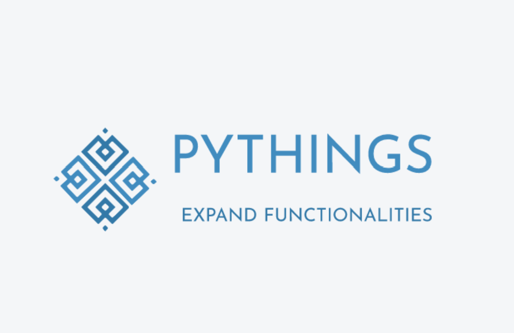

# PyThings Python Module


<div align="center">
    
  </a>


  <p align="center">
    An awesome Application to run command line Application in "daily" manner.
  </p>
   
   [About the Project](#project) | [Motivation](#motivation) | [Quick Start](#start) | [Usage](#usage) | [Features](#features) | [License](#license)

  
</div>


## 🚩Table of Contents
1. [About](#about)
2. [Installation](#installation)
3. [Importing](#importing)
4. [Commands](#commands)
   - [Class: PCTools](#pctools)
   - [Class: Dict](#dict)
   - [Class: Images](#imgs)
   - [Class: MathTools](#mtools)
   - [Class: Security](#secure)
5. [License](#license)
6. [Dev Info](#dev)
7. [Contribution](#contribution)
<a name='about'></a> 
## 📝About PyThings
PyThings is a python 3 module that expands the functionality of python. It expands the connectivity of an IDE to the PC, expands the ability of dictionaries, adds an image scraping and opening functionality, add more math functions, and add an ecryption/decryption feature.

**Currently Tested Platforms**
- Windows 11

**Dependencies**
- setuptools
- plyer
- bs4
- pillow
- cryptography


<a name='installation'></a>
## ⚙️Installation
<details>
<summary> <b> Unix/MacOS </b> </summary>
   
```powershell
python3 -m pip install --index-url https://test.pypi.org/simple/ --extra-index-url https://pypi.org/simple/ pythings==0.4.7
```
</details>

<details>
   
<summary> <b> Windows </b> </summary>
 
```powershell
py -m pip install --index-url https://test.pypi.org/simple/ --extra-index-url https://pypi.org/simple/ pythings==0.4.7
```
</details>

<a name='importing'></a>

## 🛠️Importing

<details>
<summary> <b> pythings </b> </summary>

```python
import pythings
```
</details>   
 
or (recommended)

<details>
<summary> <b> pythings as plt </b> </summary>
   
```python
import pythings as pt
```

</details>    

<a name='commands'></a>
## 🤖Commands

<details>
<summary> <b> test </b> </summary>
   
```python
pythings.test() # prints a test message to shell
```

</details>

<a name='pctools'></a>

<details>
<summary> <b> Class: PCTools </b> </summary>

```python
import pythings as pt
pctools = pt.PCTools()
pctools.pypiinstall(modname, pysrc, modsrc='pypi') # installs a python module on the users end, without importing.
# modname: name of module. pysrc: use 'web' if user installed from python.org, or 'app' if user downloaded from store. modsrc: 'pypi' for download from pypi, and 'testpypi' for download from testpypi.

pctools.notify(title, desc, appname='pythings',icon=None, time='2', status=None, toast=False) # popup desc notification. 
# See https://www.geeksforgeeks.org/python-desktop-notifier-using-plyer-module/ for documentation.

pctools.slice_mail(address) # slices an email into username and domain. Outputs a dict formatted like {'username":'pythings', 'domain':'example.com'}.
# address: email address to be sliced.

pctools.debug(filename, encodetype='utf_8') # debugs a file with same errors as the regular shell. Basically for debugging a file on the users device.
# filename: file to be debugged (must be a .py). encodetype: specifies encoding of the file (defaults to UTF 8)
```
   
</details>


<a name='dict'></a>
<details>
<summary> <b> Class: Dict </b> </summary>

```python
import pythings as pt
dtools = pt.Dict()

dtools.j2dict(obj, remove=None) # converts json to dictionary. dictionary is named the same as variable json is stored in.
# obj: variable of json to be converted. remove: specifies if any characters should be replaced in dict.

dtools.list2dict(key, content) # converts 2 lists into a dictionary. Shortens code.
# key: list with key values. content: list with content values that match key values.
```
</details>
   
<a name='imgs'></a>
<details>
<summary> <b> Class: Images </b> </summary>

```python
import pythings as pt
imgs = pt.Images()

imgs.getImage(link) # returns all image sources from a webpage as a list
# link: url of webpage to be scraped.

imgs.openImage(link, query) # opens an image in default image viewer
# link: direct link to image. query: name of image.
```
</details>   
   
<a name='mtools'></a>

<details>
<summary> <b> Class: MathTools </b> </summary>

```python
import pythings as pt
mtools = pt.MathTools()

mtools.fib(num, length='one') # returns the nth integer of the fibonnaci sequence.
# num: the nth integer. length: 'one' for the nth integer, 'all' for all fibonnaci numbers up to the nth value.
```
</details>   

<a name='secure'></a>

<details>
<summary> <b> Class: Security </b> </summary>

```python
import pythings as pt
stools = pt.Security()

stools.encrypt(text, filename) # encrypts a string using Fernet from cryptography.fernet. Returns encoded string and saves key to file.
# text: string to be encrypted. filename: file that the encoding key should be saved to (must be a .txt).

stools.decrypt(enctext, enckey) # decodes text that was encoded with the above method. Returns decoded string.
# enctext: string of characters returned by stools.encrypt(). enckey: the key saved to filename by stools.encrypt.
```
</details>   
   
<a name='license'></a>
## ⚖️License
This project is licensed under the MIT LICENSE. See `LICENSE` for more information.

<a name='dev'></a>
## 📚Dev Info (Ignore this if you are not a dev)

<details>
<summary> <b> File System: Unbuilt </b> </summary>

```graphql
.
└── App/
    ├── setup.py
    ├── Module/
    │   ├── __init__.py
    │   └── pythings.py
    ├── README.md
    └── LICENSE 
```
</details>   

<details>
<summary> <b> File System: Built </b> </summary>
   

```graphql
.
├── App/
│   ├── setup.py
│   ├── pythings.egg-info/
│   │   ├── top_level.txt
│   │   ├── SOURCES.txt
│   │   ├── requires.txt
│   │   ├── PKG-INFO
│   │   └── dependency_links.txt
│   ├── Module/
│   │   ├── __init__.py
│   │   └── pythings.py
│   ├── README.md
│   └── LICENSE
└── dist/
    ├── pythings-0.4.7.tar.gz
    └── pything-0.4.7-none-any.whl
```
</details>   

<details>
<summary> <b> Build Command </b> </summary>

```powershell
py Documents\Python_projects\pythings\App\setup.py sdist bdist_wheel
```
</details>   

<details>
<summary> <b> Upload Command </b> </summary>

```powershell
py -m twine upload --repository testpypi dist/* -u▉▉▉▉▉ -p▉▉▉▉▉
```
</details>   
   
**INFO**

- Current Version: 0.4.7
- Dev Stage: Beta Testing
- Made On: IDLE
- Programming Language: Python 3
- Natural Language: English (USA)       
- License: MIT  

<a name='contribution'></a>
## ✨Contribution
Contributions are always welcome! Please read [here](https://github.com/FormulaCarbon/pythings-Python-Module/blob/main/CONTRIBUTING.md) first. &emsp;&emsp;([Go Back to top of the page](#about)) 


